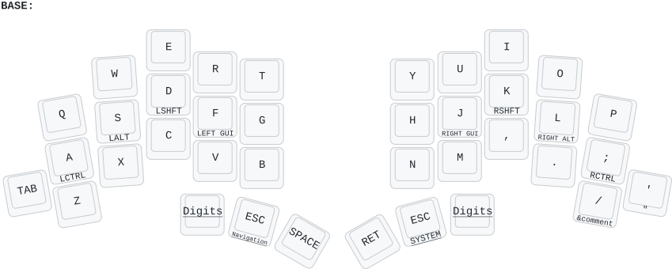
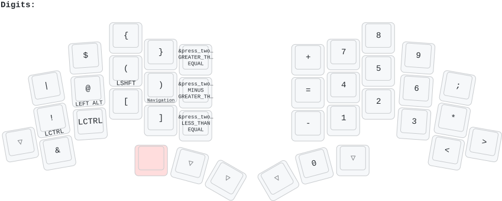
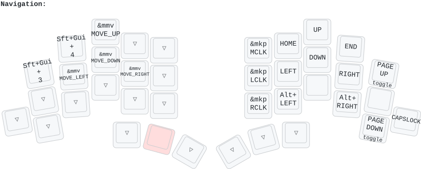
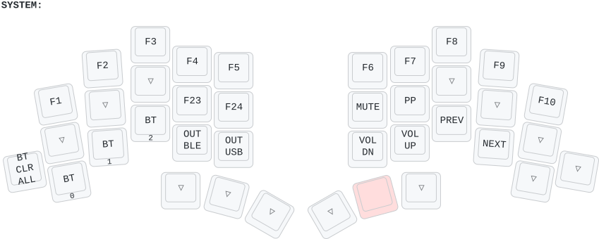
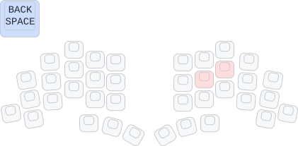
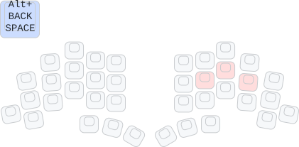
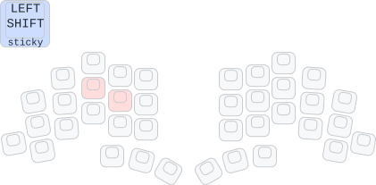
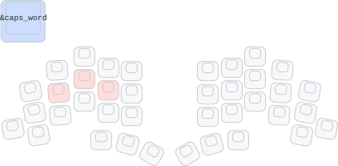
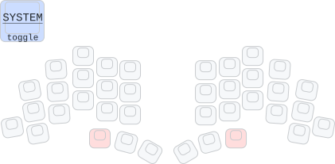

# TOTEM ZMK Firmware APS GOOD

## Назначение репозитория

Данный репозиторий содержит пользовательскую конфигурацию прошивки ZMK для клавиатуры TOTEM. Конфигурация ориентирована на повседневный набор текста на русском и английском языке, быстрый ввод сочетаний с `Ctrl`, `Alt`, `Shift`, `Win`, а также на работу с цифрами, символами, навигацией, мышью, Bluetooth и мультимедиа без отдельного цифрового блока.

В прошивке используются четыре основных слоя:

- `BASE` — основной буквенный слой;
- `Navigation` — стрелки, перемещение по тексту, мышь, `Page Up` / `Page Down`;
- `Digits` — цифры и основные специальные символы;
- `System` — Bluetooth, USB/BLE, мультимедиа, F-клавиши.

## Графическое представление раскладок

В данном разделе последовательно приведены все графические файлы, фактически расположенные в каталоге `img` текущего архива. Пояснения даны по именам файлов и их назначению в составе раскладки.

### 01. Основной слой

Файл `01_base_layer.png` содержит графическое представление основного буквенного слоя `BASE`.

### 02. Цифровой и символьный слой

Файл `02_digits_layer.png` содержит графическое представление слоя `Digits`, на котором размещены цифры и основные специальные символы.

### 03. Навигационный слой

Файл `03_navigation_layer.png` содержит графическое представление слоя `Navigation`, используемого для стрелок, перемещения по тексту и управления мышью.

### 04. Системный слой

Файл `04_system_layer.png` содержит графическое представление слоя `System`, включающего Bluetooth-профили, выбор выхода `BLE` / `USB`, мультимедиа и функциональные клавиши.

### 05. Заголовочный рисунок раздела комбо

Файл `05_Combos_header.png` является служебным графическим заголовком раздела комбо.

### 06. Комбо `Backspace`

Файл `06_backspace_combo.png` иллюстрирует комбо для ввода `Backspace`.

### 07. Комбо `Alt+Backspace`

Файл `07_altbackspace_combo.png` иллюстрирует комбо для ввода `Alt+Backspace`.

### 08. Комбо `Left Shift`

Файл `08_leftshift_combo.png` иллюстрирует комбо для sticky `Shift`.

### 09. Комбо `Caps Word`

Файл `09_capsword_combo.png` иллюстрирует комбо для включения режима `Caps Word`.

### 10. Комбо перехода на системный слой

Файл `10_system_combo.png` иллюстрирует комбо, используемое для перехода на системный слой.

### Какие схемы для комбо отсутствуют в каталоге `img`

В каталоге `img` не представлены отдельные рисунки для следующих комбо:

- комбо переключения на английский язык `C + V`;
- комбо переключения на русский язык `M + ,`;
- комбо для ввода буквы `Ё` / `ё` через `R + T`.

Для текущего архива установлено, что:

- схема комбо `C + V` присутствует в корне репозитория в файле `totem_#g2857_01.png`, но не входит в каталог `img`;
- схема комбо `M + ,` присутствует в корне репозитория в файле `totem_#g3099_01.png`, но не входит в каталог `img`;
- отдельный PNG-файл со схемой комбо `R + T` для `Ё` / `ё` в каталоге `img` отсутствует.

Дополнительно установлено, что файл `totem_#g353_01.png`, расположенный в корне репозитория, дублирует основную раскладку `BASE`, уже представленную в каталоге `img` файлом `01_base_layer.png`.

## Какие файлы прошивки используются

В `build.yaml` предусмотрены несколько вариантов сборки.

### Вариант Bluetooth без донгла

- `totem_qwerty_left`
- `totem_qwerty_right`

Эти файлы используются для обычной беспроводной split-клавиатуры без отдельного USB-донгла.

### Вариант с донглом

- `totem_qwerty_dongle_left`
- `totem_qwerty_dongle_right`
- `totem_qwerty_dongle`

Эти файлы используются, если клавиатура работает через отдельный донгл.

### Сервисная прошивка сброса

- `firmware_reset_totem`

Данная прошивка применяется для очистки старых Bluetooth-настроек и парных записей, если устройство ведёт себя нестабильно или не подключается как ожидается.

## Базовый порядок прошивки

1. Для левой половины используется файл `left`.
2. Для правой половины используется файл `right`.
3. Для варианта с донглом донгл прошивается отдельным файлом `dongle`.
4. Каждая плата переводится в загрузчик и получает свой UF2-файл отдельно.
5. После прошивки клавиатура начинает работать по логике, описанной ниже.

## Логика основного слоя

На основном слое реализован буквенный набор. При этом клавиши домашнего ряда одновременно являются модификаторами: при коротком нажатии вводится буква, при удержании — модификатор.

### Домашний ряд как модификаторы

| Клавиша | Короткое нажатие | Удержание     |
| ------- | ---------------- | ------------- |
| A       | `a`              | `Ctrl`        |
| S       | `s`              | `Alt`         |
| D       | `d`              | `Shift`       |
| F       | `f`              | `Win` / `GUI` |
| J       | `j`              | `Win` / `GUI` |
| K       | `k`              | `Shift`       |
| L       | `l`              | `Alt`         |
| `;`     | `;`              | `Ctrl`        |

Это означает, что отдельные клавиши `Ctrl`, `Alt`, `Shift`, `Win` на корпусе не требуются: нужный модификатор получается удержанием буквы домашнего ряда.

## Как вводить Ctrl-команды и другие составные сочетания

Главный принцип данной прошивки состоит в том, что модификатор удобно удерживать одной рукой, а основную клавишу нажимать другой рукой.

Это особенно важно потому, что домашние модификаторы настроены именно под перекрёстное нажатие. Поэтому для команд на левой половине часто удобнее использовать правый `Ctrl` на клавише `;`, а для команд на правой половине — левый `Ctrl` на клавише `A`.

### Примеры часто используемых сочетаний

| Команда       | Как нажимать                                |
| ------------- | ------------------------------------------- |
| `Ctrl+C`      | удерживать `;`, нажать `C`                  |
| `Ctrl+V`      | удерживать `;`, нажать `V`                  |
| `Ctrl+X`      | удерживать `;`, нажать `X`                  |
| `Ctrl+Z`      | удерживать `;`, нажать `Z`                  |
| `Ctrl+A`      | удерживать `;`, нажать `A`                  |
| `Ctrl+S`      | удерживать `;`, нажать `S`                  |
| `Ctrl+T`      | удерживать `;`, нажать `T`                  |
| `Ctrl+W`      | удерживать `;`, нажать `W`                  |
| `Alt+Tab`     | удерживать `S` или `L`, нажать `Tab`        |
| `Shift+буква` | удерживать `D` или `K`, нажать нужную букву |
| `Win+...`     | удерживать `F` или `J`, нажать вторую клавишу |

Для команд на правой половине допустимо действовать зеркально. Например, `Ctrl+P` удобно выполнять как удержание `A` и нажатие `P`.

## Тамб-кластер

Тамб-кнопки в данном описании нумеруются слева направо.

| Обозначение | Короткое нажатие                                        | Удержание         |
| ----------- | ------------------------------------------------------- | ----------------- |
| Тамб-1      | специальных действий при отдельном тапе не используется | слой `Digits`     |
| Тамб-2      | `Esc`                                                   | слой `Navigation` |
| Тамб-3      | `Space`                                                 | `Space`           |
| Тамб-4      | `Enter`                                                 | `Enter`           |
| Тамб-5      | `Esc`                                                   | слой `System`     |
| Тамб-6      | специальных действий при отдельном тапе не используется | слой `Digits`     |

Дополнительная особенность: одновременное нажатие Тамб-1 и Тамб-6 переводит клавиатуру на слой `System`.

## Русская раскладка

Русская раскладка в данной конфигурации не зашита отдельным буквенным слоем. Прошивка отправляет стандартные скан-коды клавиатуры, а русский текст появляется при переключении системной раскладки в операционной системе.

Это удобно: одна и та же физическая схема остаётся неизменной, а язык зависит от активной раскладки ОС.

### Как переключать язык

На базовом слое настроены два отдельных комбо:

| Действие                   | Комбо   |
| -------------------------- | ------- |
| Переключение на английский | `C + V` |
| Переключение на русский    | `M + ,` |

Эти комбо работают только на основном слое.

### Важное замечание по ОС

Указанные комбо не просто меняют внутренний слой, а отправляют системные сочетания:

- английский: `Left Alt + Left Shift`;
- русский: `Left Alt + Right Shift`.

Следовательно, в операционной системе должны быть назначены именно такие способы переключения раскладки. Если в системе назначены другие сочетания, языковое переключение необходимо либо перенастроить в ОС, либо изменить макросы в прошивке.

## Русские буквы на основном блоке

При активной русской системной раскладке основной слой даёт привычную привязку к схеме `ЙЦУКЕН` на основе физики `QWERTY`.

### Основной буквенный блок в русской раскладке

| Физические клавиши | Русские буквы |
| ------------------ | ------------- |
| `Q W E R T`        | `Й Ц У К Е`   |
| `Y U I O P`        | `Н Г Ш Щ З`   |
| `A S D F G`        | `Ф Ы В А П`   |
| `H J K L ;`        | `Р О Л Д Ж`   |
| `Z X C V B`        | `Я Ч С М И`   |
| `N M , . /`        | `Т Ь Б Ю .`   |
| `'`                | `Э`           |

### Буква `Ё` / `ё`

Для буквы `Ё/ё` в прошивке настроено отдельное комбо на основном слое.

| Что требуется ввести | Как нажимать                     |
| -------------------- | -------------------------------- |
| `ё`                  | одновременно `R + T`             |
| `Ё`                  | удерживать `Shift`, одновременно нажать `R + T` |

Практически это работает так:

- в русской раскладке физические клавиши `R` и `T` соответствуют буквам `К` и `Е`;
- их одновременное нажатие отправляет скан-код `` ` `` (`GRAVE`);
- в русской системной раскладке этот скан-код даёт `ё`, а с `Shift` — `Ё`.

Важно: это именно одновременное комбо, а не последовательный набор букв `к`, затем `е`.

## Где искать буквы и символы, которых нет в основном буквенном блоке

Для компактной клавиатуры часть знаков вынесена на слой `Digits`.

### Буквы, о которых чаще всего возникает вопрос

| Буква / символ | Где находится                         |
| -------------- | ------------------------------------- |
| `ж`            | на основном слое, клавиша `;`         |
| `ю`            | на основном слое, клавиша `.`         |
| `ь`            | на основном слое, клавиша `M`         |
| `э`            | на основном слое, клавиша `'`         |
| `ё`            | комбо `R + T` на основном слое        |
| `х`            | на слое `Digits`, клавиша `[`         |
| `ъ`            | на слое `Digits`, клавиша `]`         |

Практически это означает следующее:

- для `ж` достаточно обычного нажатия `;` при активном русском языке;
- для `ю` используется обычное нажатие `.`;
- для `ь` используется клавиша `M`;
- для `э` используется клавиша `'`;
- для `ё` требуется одновременное нажатие `R + T`;
- для `х` следует удержать `Digits` и нажать клавишу, на которой в английском режиме находится `[`;
- для `ъ` следует удержать `Digits` и нажать клавишу, на которой в английском режиме находится `]`.

После последней правки клавиши `[` и `]` на слое `Digits` работают как обычные символы. Это сделано специально, чтобы `х` и `ъ` вводились надёжно и без побочного получения заглавных букв.

## Слой Digits: цифры и символы

Слой `Digits` вызывается удержанием Тамб-1 или Тамб-6.

На правой половине цифры расположены по логике цифрового блока:

| Позиция     | Что вводится |
| ----------- | ------------ |
| верхний ряд | `7 8 9`      |
| средний ряд | `4 5 6`      |
| нижний ряд  | `1 2 3`      |
| Тамб-5      | `0`          |

На левой половине расположены основные символы:

| Ряд         | Символы                        |
| ----------- | ------------------------------ |
| верхний ряд | `|`, `$`, `{`, `}`, `>=`, `+` |
| средний ряд | `!`, `@`, `(`, `)`, `->`, `=` |
| нижний ряд  | `&`, `Ctrl`, `[`, `]`, `<=`, `-` |

Дополнительно на правом краю нижнего ряда слоя `Digits` теперь размещены:

| Клавиша на слое `Digits`           | Символ |
| ---------------------------------- | ------ |
| предпоследняя клавиша нижнего ряда | `<`    |
| последняя клавиша нижнего ряда     | `>`    |

Это означает следующее:

- `.` и `/` больше не дублируются на слое `Digits`;
- символы `<` и `>` перенесены на слой `Digits` и доступны без конфликта с русскими буквами;
- `х` и `ъ` сохраняются на `[` и `]`.

Дополнительные особенности слоя `Digits`:

- доступны готовые составные символы `->`, `<=`, `>=`;
- одна из левых клавиш выдаёт отдельный `Ctrl`, что может быть полезно в редких случаях;
- на среднем ряду одна клавиша при удержании открывает `Navigation`.

## Слой Navigation

Слой `Navigation` вызывается удержанием Тамб-2.

На этом слое размещены:

- стрелки;
- `Home`, `End`, `Page Up`, `Page Down`;
- навигация `Alt+Left` и `Alt+Right`;
- управление мышью;
- `Caps Lock`.

### Управление мышью

Движение мыши назначено на блок `E / S / D / F`:

| Клавиша | Действие          |
| ------- | ----------------- |
| `E`     | курсор мыши вверх |
| `S`     | курсор мыши влево |
| `D`     | курсор мыши вниз  |
| `F`     | курсор мыши вправо |

Клики мыши:

| Клавиша | Действие            |
| ------- | ------------------- |
| `Y`     | средняя кнопка мыши |
| `H`     | левая кнопка мыши   |
| `N`     | правая кнопка мыши  |

Навигационный блок справа:

| Клавиши | Действие                |
| ------- | ----------------------- |
| `U I O` | `Home`, `Up`, `End`     |
| `J K L` | `Left`, `Down`, `Right` |
| `P`     | `Page Up`               |
| `/`     | `Page Down`             |
| `M`     | `Alt+Left`              |
| `.`     | `Alt+Right`             |

На верхнем левом участке также присутствуют две системные комбинации `Shift+GUI+3` и `Shift+GUI+4`. Их эффект зависит от операционной системы и обычно используется как системные горячие клавиши.

## Слой System

Слой `System` вызывается удержанием Тамб-5 или одновременным нажатием Тамб-1 и Тамб-6.

На слое находятся:

- `F1`–`F10`;
- мультимедийные клавиши;
- управление профилями Bluetooth;
- переключение выхода `BLE` / `USB`.

### Bluetooth и подключение

| Клавиша | Действие                          |
| ------- | --------------------------------- |
| `Tab`   | очистка всех Bluetooth-сопряжений |
| `Z`     | выбрать профиль Bluetooth 0       |
| `X`     | выбрать профиль Bluetooth 1       |
| `C`     | выбрать профиль Bluetooth 2       |
| `V`     | вывод через BLE                   |
| `B`     | вывод через USB                   |

Если клавиатура перестала подключаться или пытается соединяться не с тем устройством, обычно сначала очищаются старые пары, затем выбирается нужный профиль.

## Особенности отдельных клавиш и комбо

### Backspace

Отдельной клавиши `Backspace` на основном слое нет. Вместо неё используются комбо:

| Комбо       | Действие        |
| ----------- | --------------- |
| `J + K`     | `Backspace`     |
| `J + K + L` | `Alt+Backspace` |

Это один из ключевых элементов освоения данной прошивки.

### Shift как комбо

| Комбо   | Действие       |
| ------- | -------------- |
| `D + F` | sticky `Shift` |

Такой `Shift` удобно использовать для одиночной заглавной буквы или одного символа верхнего регистра.

### Caps Word

| Комбо       | Действие    |
| ----------- | ----------- |
| `S + D + F` | `Caps Word` |

Режим удобен для ввода последовательности заглавных букв без постоянного удержания `Shift`.

### Комбо для `Ё` / `ё`

| Комбо              | Действие |
| ------------------ | -------- |
| `R + T`            | `ё`      |
| `Shift + R + T`    | `Ё`      |

Комбо работает только на основном слое и требует одновременного нажатия обеих клавиш.

### Клавиша `/`

Клавиша `/` на основном слое имеет дополнительное поведение:

- короткое нажатие — `/`;
- удержание — макрос `/*`.

Это полезно при наборе фрагментов кода и комментариев в стиле C-подобных языков.

### Клавиша `'`

Правая крайняя нижняя клавиша работает следующим образом:

- короткое нажатие — `'`;
- более длительное нажатие — `"`.

В русской раскладке короткое нажатие этой клавиши обычно даёт букву `Э`.

## Что полезно запомнить в первую очередь

Для начала практического использования достаточно запомнить следующий минимум:

1. `A/S/D/F` и `J/K/L/;` — это домашние модификаторы.
2. Тамб-2 удерживается для навигации, Тамб-5 — для системных функций.
3. Тамб-1 и Тамб-6 удерживаются для слоя `Digits`.
4. `C+V` — английский, `M+,` — русский.
5. `J+K` — `Backspace`.
6. `R+T` — `ё`, а с `Shift` — `Ё`.
7. `; + C`, `; + V`, `; + S`, `; + Z` — базовые `Ctrl`-команды.
8. `;` в русском — это `ж`, `.` — это `ю`, `M` — это `ь`, `Э` находится на `'`, а `х` и `ъ` находятся на слое `Digits`.
9. `<` и `>` находятся на двух крайних правых позициях нижнего ряда слоя `Digits`.

После освоения этих правил прошивкой уже можно пользоваться в обычной работе без обращения к исходному коду.
